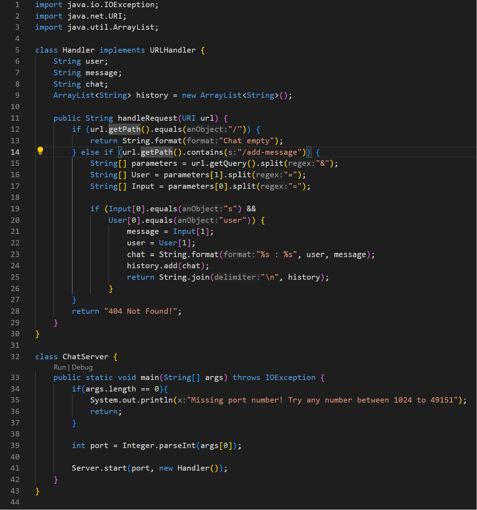
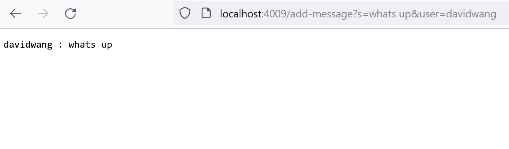
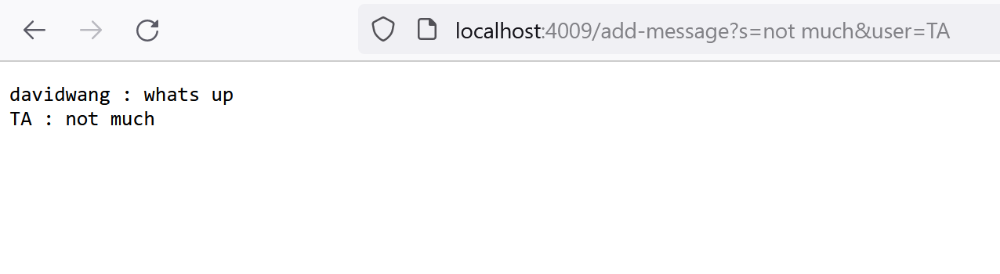
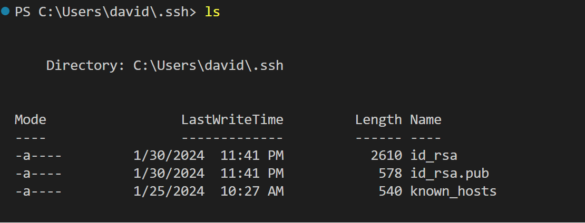
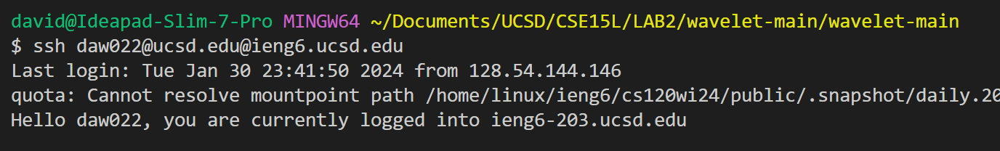

# Lab Report 2

**Code for ChatServer:**
 
- The ```handleRequest``` method and the ```main``` method are called in my code (located in different classes).
- url of object URI is a relevant argument to the ```handleRequest``` method. The args array of String objects is the other relevant argument to the ```main``` method.
- The user, message, chat, and history fields are changed when a specific request is given. The fields are updated based on the query of the URI. An example of this would be if a request with the URI: ```/add-message?s=Hello&user=David``` is given, the user field would be "David", the message field would be changed to "Hello", and the chat field would be the "David: Hello". This chat field would be added to the ```history``` arrayList. For the ```ChatServer``` class, the port field can be changed by giving a command line argument.
- 

**Images of add message:**
 
 
- The ```handleRequest``` method in the ```Handler``` class and the ```main``` method in the ```ChatServer``` class are called in my code.
- The relevant arguments to the methods are the args array in the ```main``` method and the url in the ```handleRequest``` method. 
- The user, message, chat, and history fields are changed when a specific request is given. The fields are updated based on the query of the URI.
- 

**Part two:**
 
 
 

 
**Part three:**
I learned in lab from weeks two and three that you could remotely login into a server using ssh. I also learned about localhost and port numbers. 
